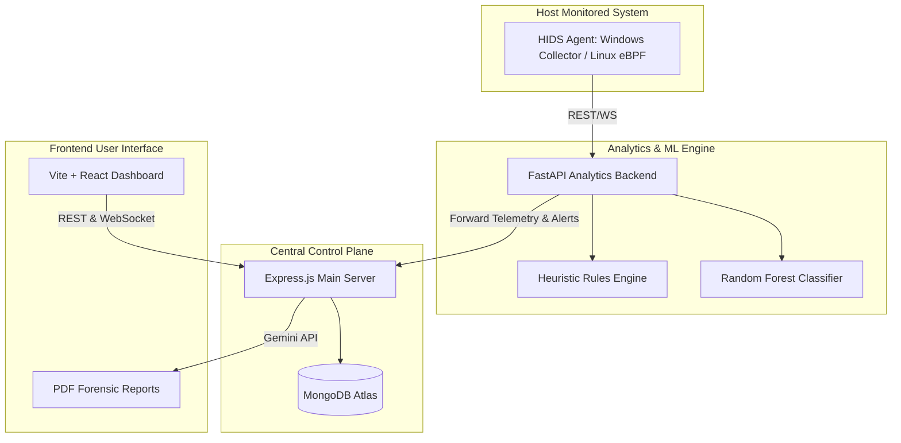

# 🛡️ AI-HIDS: AI-Powered Host Intrusion Detection System
[](https://opensource.org/licenses/MIT)
[](https://www.python.org/)
[](https://nodejs.org/)
[](https://react.dev/)
[](https://fastapi.tiangolo.com/)
An advanced, hybrid Host Intrusion Detection System (HIDS) combining real-time system event telemetry (Windows WMI/psutil & Linux eBPF/BCC), machine learning-driven anomaly detection, heuristic security rule matching, a centralized Node/Express control plane with MongoDB, and an interactive React/Vite dashboard featuring AI-powered forensics report generation using the Gemini API.
---
## 🔗 Live Deployment
🚀 You can access the live dashboard deployment here:
**👉 [AI-HIDS Dashboard Live Demo](https://ai-hids-frontend.onrender.com) 👈**
---
## 🏗️ Architecture Overview
The system is composed of four distinct components working in synchrony:

### 🛰️ 1. Telemetry Agent (`/backend`)
Runs directly on the host system to monitor and record low-level activity.
- **Windows Telemetry**: Evaluates process states, parent-child process chains, CPU/memory performance, network sockets, and file-system changes using WMI and `psutil`.
- **Linux Telemetry**: Employs an **eBPF (Extended Berkeley Packet Filter)** program via BCC hooks to capture kernel-level system calls such as `execve` (process spawns), `openat` (file access), and network connection attempts.
- **Simulate Mode**: Simulates various threat actions (ransomware encryption loops, credential theft accesses to sensitive files, exfiltration network bursts, shell spawns) for risk assessment testing.
### 🧠 2. FastAPI Analytics Backend (`/backend`)
Serves as the high-performance ML analysis server.
- **ML Detection Engine**: Random Forest Classifier trained on system call patterns and process metrics to identify anomalous executions (e.g. ransomware, credential theft, network exfiltration, shell spawns).
- **Heuristic Rule Engine**: Real-time evaluation of telemetry events against security rules (e.g., accesses to `/etc/shadow`, `sam`, or SSH keys, process execution in `/tmp` or `Recycle.Bin`, anomalous parent-child execution chains).
- **Control Socket**: Maintains a bi-directional WebSocket connection to the host agent to deploy mitigation commands (process termination) when threats are detected.
### 🎛️ 3. Express Main Server (`/main_server`)
Handles user accounts, data persistence, and administrative integrations.
- **MongoDB Atlas Integration**: Stores security alerts, raw telemetry logs, host groups, and users securely.
- **WebSocket Broadcaster**: Establishes a real-time event pipeline to broadcast telemetry sweeps and critical alerts directly to active dashboard sessions.
- **AI-Powered Forensics**: Connects with the **Google Gemini API** to generate markdown and downloadable PDF reports analyzing flagged threats and compiling automated security recommendations.
- **Email Notifications**: Alerts security teams immediately when high-risk intrusion detections occur.
### 💻 4. React Frontend (`/frontend`)
A premium, dark-mode, responsive web dashboard built with React 19, Vite, Tailwind CSS, Lucide icons, and Recharts.
- **Telemetry Console**: View real-time running processes, CPU usage, and memory usage.
- **Security Alerts Portal**: View active and dismissed intrusion warnings, view process ancestry trees, and trigger mitigations.
- **ML Pipeline Controls**: Trigger model retraining or view training metrics.
- **Sensor Groups**: Organize separate client machines into logical administrative groups.
---
## 🛠️ Tech Stack & Dependencies
### Frontend
- **Framework**: React 19 (Vite, Tailwind CSS, Lucide React)
- **State Management**: Redux Toolkit (`@reduxjs/toolkit`)
- **Routing**: React Router DOM
- **Data Visualization**: Recharts
### Main Server (Control Plane)
- **Runtime**: Node.js >= 18 (Express.js)
- **Database**: MongoDB (Mongoose ODM)
- **Real-Time Communication**: `ws` (WebSockets)
- **AI/LLM**: `@google/generative-ai` (Gemini API)
- **PDF Export**: `pdfkit`
- **Mailers**: `nodemailer`
### Analytics & Agents
- **Runtime**: Python 3.11.9 (FastAPI & Uvicorn)
- **Data & ML**: `pandas`, `numpy`, `scikit-learn`, `joblib`
- **System APIs**: `psutil`, `requests`, `websocket-client`
- **Linux eBPF**: BCC framework
---
## ⚙️ Configuration & Environment Variables
Create a `.env` file in the **project root** containing the following values:
```env
# ── JWT Authentication ────────────────────────────────────────────────────────
JWT_SECRET=your_jwt_secret_key
# ── Gemini AI (PDF Report Generation) ────────────────────────────────────────
GEMINI_API_KEY=your_gemini_api_key
# ── MongoDB ───────────────────────────────────────────────────────────────────
MONGODB_URI=your_mongodb_connection_uri
DATABASE_NAME=hids_db
# ── SQLite (FastAPI local store) ──────────────────────────────────────────────
SQLITE_URL=sqlite:///./hids.db
# ── FastAPI Analytics Backend ─────────────────────────────────────────────────
HOST=127.0.0.1
PORT=8001
# ── Sensor Agent ──────────────────────────────────────────────────────────────
BACKEND_URL=http://127.0.0.1:8001
SENSOR_ID=sensor-windows-testing
SENSOR_KEY=testing-secure-key-321
# ── Express.js Main Server ────────────────────────────────────────────────────
EXPRESS_PORT=8000
EXPRESS_HOST=0.0.0.0
# ── FastAPI Analytics Backend URL (Express forwards to this) ──────────────────
FASTAPI_URL=http://127.0.0.1:8001
```
---
## 🚀 Installation & Running Locally
### 1. Verification & Automatic Install
You can verify your environment and install dependencies automatically across all folders by running the installer scripts in the root directory.
- **On Windows (PowerShell)**:
  ```powershell
  ./install.ps1
  ```
- **On Windows (Command Prompt / Batch)**:
  ```cmd
  install.bat
  ```
*Alternatively, manually install dependencies:*
```bash
# Backend / Agent
pip install -r backend/requirements.txt
# Main Server
cd main_server && npm install
# Frontend
cd ../frontend && npm install
```
### 2. Running the System
You must start the backend, agent, main Express server, and frontend server.
#### A. Start the Backend & Host Agent
- **Using Launcher Script (Windows)**:
  ```powershell
  ./run.ps1
  ```
  *(Launches the FastAPI Analytics Backend on port `8001` and starts the telemetry agent in simulated threat mode).*
- **Manual Start**:
  ```bash
  # 1. Start FastAPI Analytics Backend
  cd backend
  python -m uvicorn main:app --host 127.0.0.1 --port 8001 --reload
  # 2. Run Telemetry Agent (Simulated mode)
  cd backend
  python agent.py --simulate --backend http://127.0.0.1:8001
  ```
#### B. Start the Central Express Server
```bash
cd main_server
npm run dev
```
*(Starts on http://localhost:8000. Express connects to MongoDB and initializes the WebSocket Broadcaster).*
#### C. Start the React Frontend Dashboard
```bash
cd frontend
npm run dev
```
*(Starts on http://localhost:5173. The dashboard connects to the local Express server and listens for real-time WebSocket telemetry updates).*
---
## 🔒 License
This project is licensed under the MIT License - see the [LICENSE](LICENSE) file for details.
